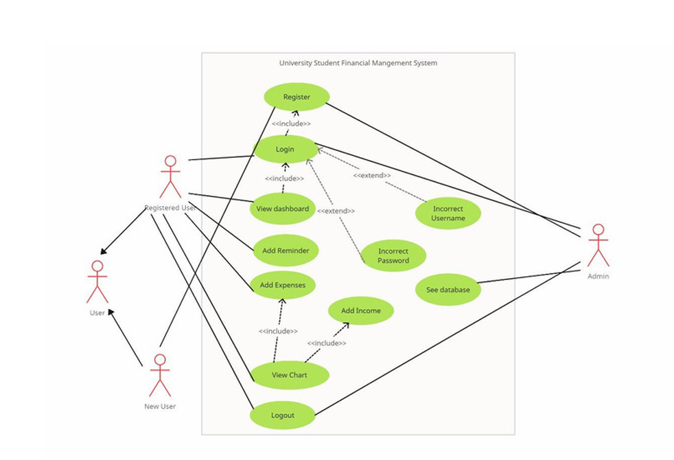
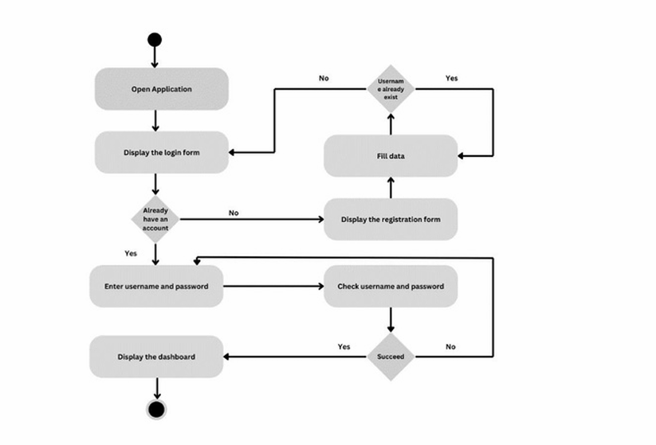
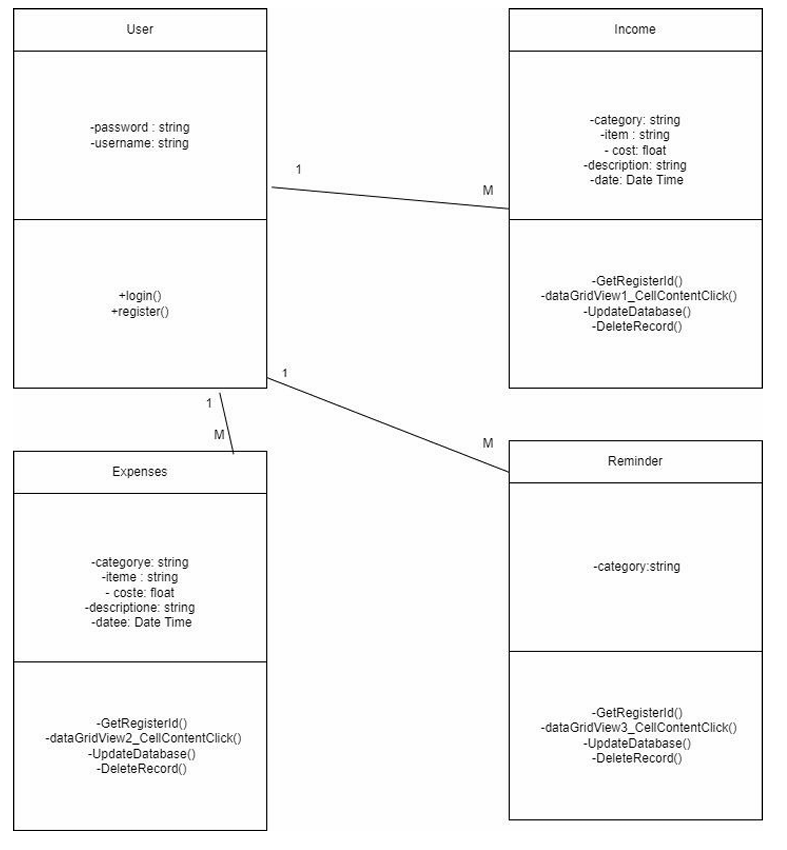

# Financial Navigator: The SAD Case Study for University Financial Management

[-orange.svg>)]()

## 💡 The Business Problem: Bridging the Financial Literacy Gap

Our analysis identified a critical gap: University students struggle to manage limited income against variable expenses, leading to financial stress. Existing commercial tools lack features tailored to student life (e.g., financial aid tracking).

**Project Goal:** To design, analyze, and propose a user-centric desktop application to facilitate effective budgeting, expense tracking, and financial planning for this underserved demographic.

---

## 🔎 Phase 1: Deep Dive Analysis & Requirements Gathering

This section highlights the foundational work that defined the system's success.

### A. Requirements Elicitation

We employed a mixed-method approach to gather accurate user needs:

- **Stakeholder Interviews & Surveys:** Conducted targeted interviews with university students (the primary user group) to capture pain points, feature desires, and existing budgeting methods (documented in _Interviews with university students.pdf_).
- **Gap Analysis:** This directly led to the requirement for specific features like **Financial Aid Integration** and a secure, private, non-cloud-based tracking system.

### B. Feasibility Study & ROI Justification

The project's viability was assessed across four dimensions. This is a crucial BA deliverable.

| Feasibility Dimension | Outcome / Key Finding                                                                                                                                                                        |
| :-------------------- | :------------------------------------------------------------------------------------------------------------------------------------------------------------------------------------------- |
| **Operational**       | High user acceptance due to tailored, student-specific features.                                                                                                                             |
| **Technical**         | C# and MySQL were selected as a **stable, low-risk, and cost-effective stack**.                                                                                                              |
| **Schedule**          | Project completion was feasible within the **42-day timeframe**.                                                                                                                             |
| **Economic**          | Calculated a highly favorable **Return on Investment (ROI) of 66.67%** and a projected **payback period of 7.2 months**. _This robust justification validated the project's business value._ |

---

## 📐 Phase 2: System Design & Modeling Artifacts

The analysis translated directly into robust, traceable design specifications documented in the **System Requirement Specification (SRS)** and supporting UML models.

### A. Core Requirements and Documentation

- **System Requirement Specification (SRS):** Documented approved **Functional Requirements** (e.g., track income/expense, generate reports) and **Non-Functional Requirements** (e.g., security using BCrypt, high usability).

### B. UML Modeling and Design

We used industry-standard Unified Modeling Language (UML) diagrams to communicate the system's structure and behavior to the development team.

| Artifact             | Purpose for the BA                                                                                                                   | Visual Aid             |
| :------------------- | :----------------------------------------------------------------------------------------------------------------------------------- | :--------------------- |
| **Use Case Diagram** | Defines all interactions between the _User_ and the _System_ (e.g., Log In, Track Expense, Set Reminder).                            | **[Use Case Diagram]** |
| **Activity Diagram** | Maps the detailed flow of complex processes, such as the _Expense Tracking Process_, ensuring logical design efficiency.             | **[Activity Diagram]** |
| **Class Diagram**    | Identified the core entities (User, Income, Expense, Budget) and their relationships, laying the groundwork for the database schema. | **[Class Diagram]**    |

### Visual Documentation (SAD Artifacts)

#### 1. Use Case Diagram

This model shows the complete functional scope of the **Financial Navigator** system.

#### 2. Activity Diagram

This model illustrates the step-by-step flow of a key process, such as submitting a new expense.

#### 3. Class Diagram

This model represents the static structure of the system, which directly informed the MySQL database design.

---

## 💻 The Final Solution (Brief Technical Summary)

The documented design was successfully implemented as a proof-of-concept application.

- **Client:** C# Windows Forms (Standalone Desktop Application)
- **Database:** MySQL Database
- **Security:** BCrypt Hashing (Ensuring NFR compliance for secure authentication)

### Conclusion

This project successfully demonstrates my ability to execute the **full System Analysis and Design lifecycle**—from problem identification and rigorous **requirements gathering** to performing a **value-driven Feasibility Study (66.67% ROI)**, and producing detailed, industry-standard **UML design artifacts**.
